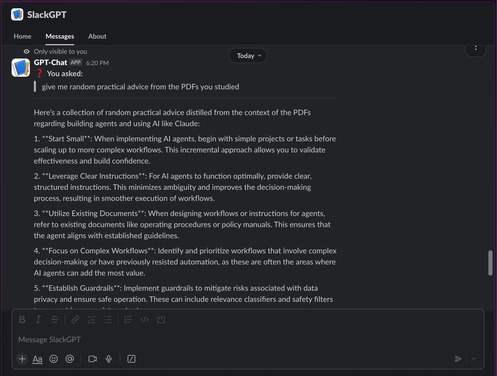

# Slack GPT-Assistant 🤖



---

## 📖 Project Overview

**Slack GPT-Assistant** is a Slack bot that answers your questions by combining a local PDF-based knowledge base with OpenAI’s GPT-4o-mini.  
It listens for `/ask` commands, immediately acknowledges receipt, then performs RAG-style lookups in your PDF docs (via Redis cache) and on-demand queries to the OpenAI API.

<div>
    <a href="https://www.loom.com/share/8c26fff5de444e8e86d5b6b4a1f3a3c7">
      <p>Exploring Slack GPT Assistant Features - Watch Video</p>
    </a>
    <a href="https://www.loom.com/share/8c26fff5de444e8e86d5b6b4a1f3a3c7">
      
    </a>
  </div>

---

## 🚀 Key Features

- **PDF Knowledge Base**  
  Upload any PDFs (manuals, guides, specifications) and let the bot search and extract relevant context.

- **GPT-4o-mini Integration**  
  Generates coherent, human-like answers and follow-up explanations when PDF context alone is insufficient.

- **Redis Caching**  
  Stores recent Q&A to save tokens and deliver instant responses on repeated questions.

- **Asynchronous Workflow**  
  Immediate “Request received” in Slack, with detailed answer delivered shortly after—no UI hangs.

- **Full Docker Packaging**  
  Single container includes your app, Redis, and all dependencies—deploy anywhere in minutes.

---

## ⚙️ Prerequisites

- Python 3.11+  
- Docker  
- ngrok (for local development/testing)  
- Redis (local or hosted)  
- Slack App credentials:  
  - Bot Token (`SLACK_BOT_TOKEN`)  
  - Signing Secret (`SLACK_SIGNING_SECRET`)  
- OpenAI API Key (`OPENAI_API_KEY`)

---

## 🔒 Environment Variables

Copy `.env.example` to `.env` and fill in:

```dotenv
SLACK_BOT_TOKEN=…
SLACK_SIGNING_SECRET=…
OPENAI_API_KEY=…
REDIS_HOST=…
REDIS_PORT=…
REDIS_PASSWORD=…
PDF_DATA_DIR=./data/company_docs
MAX_CONTEXT_TOKENS=7000    # optional override
## Setup Instructions
1. **Clone the Repository:**
   ```bash
   git clone <repository_url>
   cd slack-gpt-assistant
   ```
2. **Configure Environment Variables:**
   - Copy the template file:
     ```bash
     cp .env.example .env
     ```
   - Edit `.env` to provide your Slack, OpenAI, and Redis credentials, and specify the path to your PDF documents.
3. **Prepare PDF Documents:**
   Place all required PDF documents into the directory specified by `PDF_DATA_DIR`.

## Build Instructions
Build the Docker image with the following command:
```bash
docker build -t slack-gpt-assistant .
```

## Run Instructions
Run the Docker container:
```bash
docker run -p 3000:3000 --env-file .env -v $(pwd)/data:/app/data slack-gpt-assistant
```
Explanation:
- `-p 3000:3000`: Maps the container's port 3000 to the host.
- `--env-file .env`: Loads environment variables.
- `-v $(pwd)/data:/app/data`: Mounts your local `data` directory (containing PDFs) into the container.

## 🔌 Slack App Configuration
1. **Expose Local Server:**
   Use ngrok to expose your local server:
   ```bash
   ngrok http 3000
   ```
2. **Configure Request URL:**
   In your Slack App settings, set the Request URL for slash commands (e.g., `/ask` and `/help`) to the ngrok URL (e.g., `https://<ngrok-id>.ngrok.io/slack/events`).

## 🎯 Usage
- **/ask <question>**: Ask the bot a question. The bot acknowledges immediately, then provides an answer asynchronously based on a search of PDF documents and OpenAI API results.
- **/help**: Displays help information outlining how to use the bot.

## Features
- **Slack Command Handling:** Responds to `/ask` and `/help` commands in Slack.
- **PDF Knowledge Base:** Extracts text from PDFs using PyMuPDF for contextual responses.
- **Redis Caching:** Caches Q&A pairs to improve performance.
- **OpenAI Integration:** Uses gpt-4o-mini to generate responses.
- **Asynchronous Processing:** Provides immediate command acknowledgment with asynchronous detailed responses.
- **Logging & Error Handling:** Logs significant events and gracefully handles errors.

## Project Architecture
For a high-level overview of the project's architecture, refer to the [Architecture Document](./.ai/arch.md). The app is built as a monolithic Docker container with dedicated services for handling Slack events, PDF data extraction, OpenAI API interactions, and Redis caching.

## Redis Setup
For local development, you can run a Redis server using Docker. For example, execute the following command:
```bash
docker run --name slack-redis -p 6379:6379 -d redis:6.2-alpine
```
Then, update your `.env` file with the following settings:
- `REDIS_HOST=localhost`
- `REDIS_PORT=6379`
- (Optional) Set `REDIS_PASSWORD` if your Redis instance requires authentication.

## Development
Install development dependencies:
```bash
pip install -r requirements-dev.txt
```
Format, lint, and test your code:
```bash
black .
isort .
flake8 .
mypy .
pytest
```

## Dependencies

- `tiktoken` (for token counting, used in KnowledgeBaseService context selection)

## License
[MIT](LICENSE) 